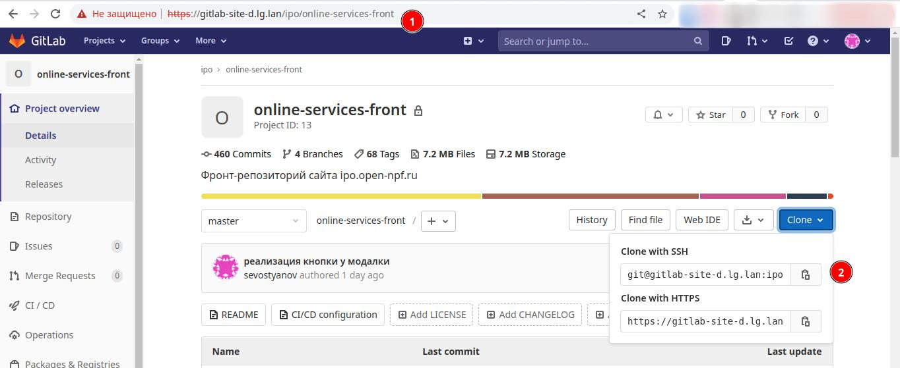
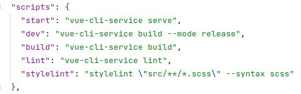

# Установка проекта и билд результат

***

## 1. Скачиваем проект
> Для доступа к **Online Services** вам потребуется настройка и подключение по VPN. Проект находится на GitLab сервере компании **ОТКРЫТИЕ**.

#### Чтобы скачать проект для локальной разработки требуется:
* зайти на GitLab репозиторий проекта [online-services-front](https://gitlab-site-d.lg.lan/ipo/online-services-front "ссылка на репозиторий проекта")
* командой `git clone` закачать локально к себе на ПК репозиторий с проектом

```
git clone git@gitlab-site-d.lg.lan:ipo/online-services-front.git
```
  


## 2. Устанавливаем проект
#### Для разворачивания проекта локально на ПК требуется:
* скачать проект (см. пункт 1)
* проверить на наличее установленного программного обеспечения `Node.js` и `NPM`.
* **!!! ВАЖНО !!!** данное програмное обеспечение не должно быть ниже указанных версий из списка ниже.
  - **`Node.js` v16.16.0**
  - **`NPM` 8.11.0**
* после выполнения условий перечисленных выше требуется выполнить команду `npm i`.

## 3. Команды проекта
> В проекте есть несколько команд от основных до вспомогательных требующихся для запуска проекта и стайлкодинга.
#### Список команд:
* `npm start` - запускает проект.
* `npm run dev` - собирет билд проекта для тестовой площадки на бекенде.
* `npm run build` - собирет билд проекта для релизной площадки на бекенде.
* `npm run lint` - запускает линтинг js проекта.
* `npm run stylelint` - запускает линтинг стилей scss проекта.



## 4. Основные NPM пакеты проекта
* axios
* inputmask
* normalize-scss
* vue
* vue-js-modal
* vue-multiselect
* vue-router
* vue-upload-component
* vuejs-datepicker
* vuex
* pug
* bempug
* webpack

## 5. Деплой приложения
> Чтобы загрузить последнюю версию приложения после внесенных изменений требуется произвести билд. Так как на бекенде существует два сервера тестовый и релизный, то соответственно есть нюансы для билда приложения и загрузки на данные хостинги бекенда.

#### Чтобы загрузить на тестовую среду потребуется:
* вводим команду `npm run dev`
* полученный билд преносим в репозиторий [online-services-front-html-test](https://gitlab-site-d.lg.lan/ipo/html-test "репозиторий для тестовой площадки")
* подключаемся по ssh к тестовому серверу _(10.28.8.27)_
* переходим по пути `/home/bitrix/ipo-agent/application/app`
* и забирем изменения командой `git pull` с репозитория тестовой версии приложения [online-services-front-html-test](https://gitlab-site-d.lg.lan/ipo/html-test "репозиторий для тестовой площадки")

#### Чтобы загрузить на релизную среду потребуется:
* вводим команду `npm run build`
* полученный билд преносим в репозиторий [online-services-front-html](https://gitlab-site-d.lg.lan/ipo/html "репозиторий для релизной площадки")
* подключаемся по ssh к тестовому серверу _(10.28.8.28)_
* переходим по пути `/home/bitrix/ipo-agent/application/app`
* и забирем изменения командой `git pull` с репозитория релизной версии приложения [online-services-front-html](https://gitlab-site-d.lg.lan/ipo/html-test "репозиторий для релизной площадки")
