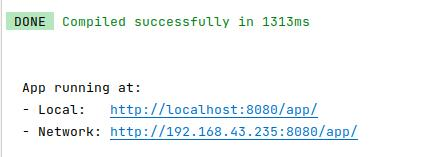
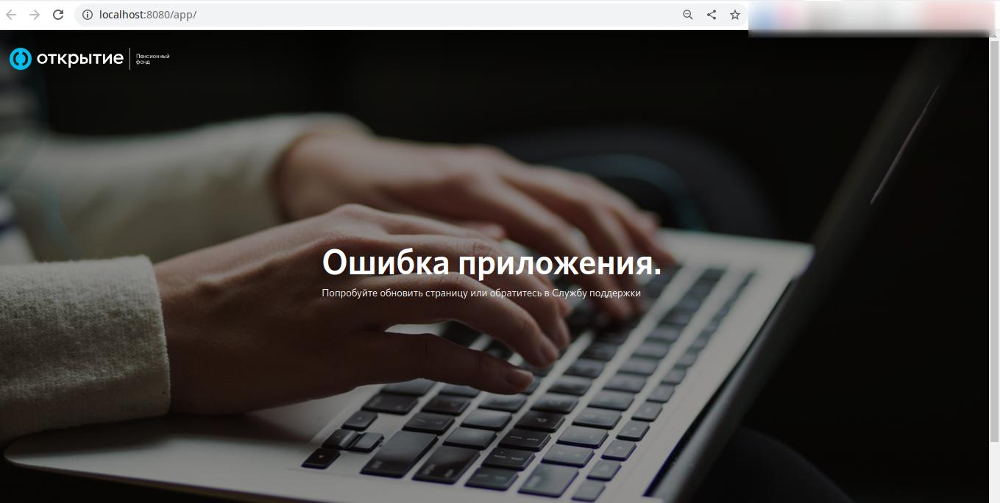
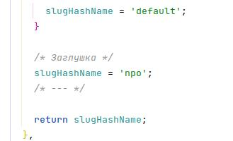
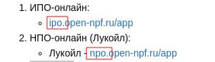
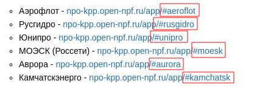

# Общее описание работы проекта при локальной разработке

***

> В первую очередь хотелось бы сказать что основная разработка **Online Services** ведется на фреймворке `VUE`, шаблонизаторе `PUG` и препроцессоре `SCSS`. Это самые частые инструменты с которыми разработчику придется взаимодействовать в данном проекте.

#### После запуска проекта для разработки есть ряд нюансов которые нужно учесть и ознакомиться с ними.

***

После ввода команды `npm start` в терминале вы увидите сообщение об успешном выполнение сборки проекта и две ссылки для просмотра проекта и отслеживания изменений вносимых при разработке.

***

После перехода одной из ссылок в терминале у вас в браузере откроется сборка вашего приложения. На странице вы увидете сообщение - _Ошибка приложения_.

***

Чтобы увидеть желаемый вами сервис требуется найти файл `common.js` и переменной `slugHashName` присвоить значение в виде строки по названию нужного вам сервиса. 

Для сервисов **ИПО-онлайн** и **НПО-онлайн (Лукойл)** нужно прописать значение из начала их доменного имени это `ipo` и `npo`.

Для сервисов **НПО-КПП** нужно прописать значание после хештега из доменного имени которое находится в конце и нейминг соответствует названию данного сервиса.

