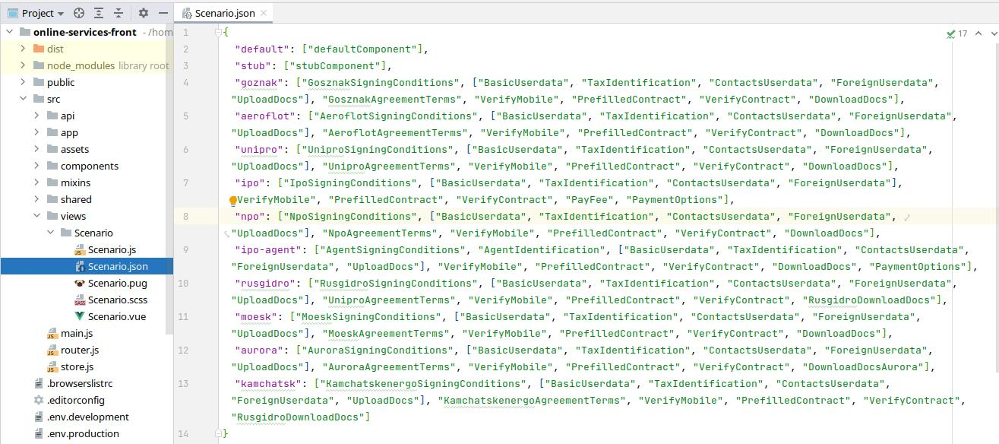
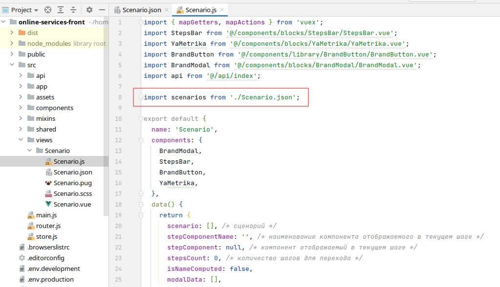
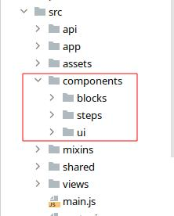

# Общие сведения по коду Online Services

> Проект написан на фреймворке VUE и поэтому является SPA веб-приложением. В проекте Online Services все разбито на компоненты. И к каждому отдельному сервису подключаются нужные для его работы компоненты.

1. Итоговые подключаемые компоненты находятся в файле `Scenario.json`. В данном файле мы видим к какому сервису подключены какие компоненты.
   

2. Файл `Scenario.json` подключается в файле `Scenario.js` для работы с подключенными компонентами к сервису.
   

3. В папке `components` собраны основные компоненты проекта.
   
