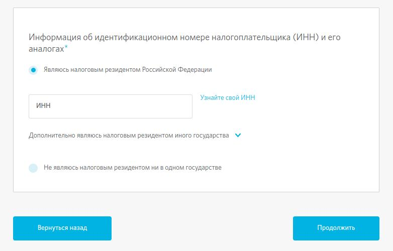
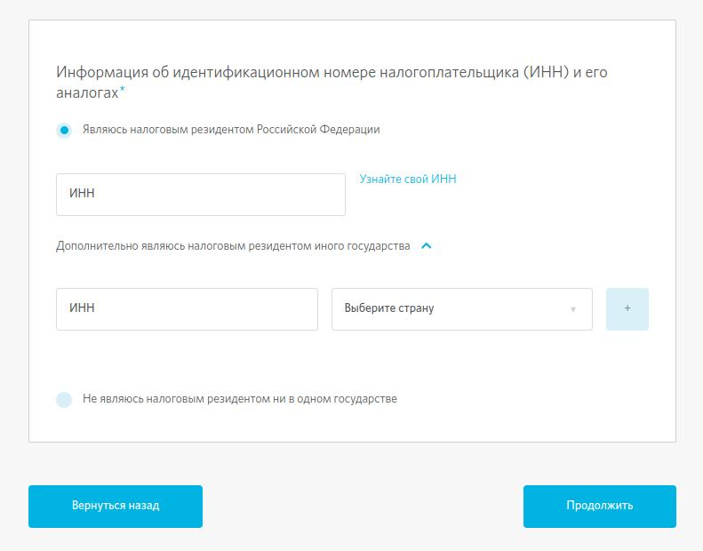
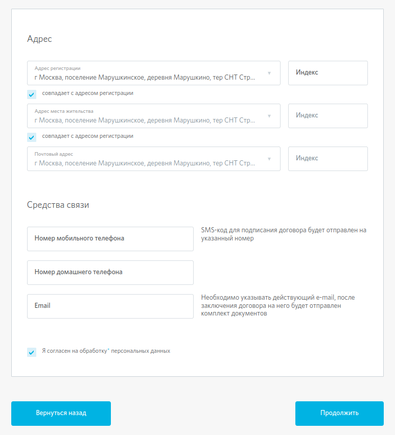
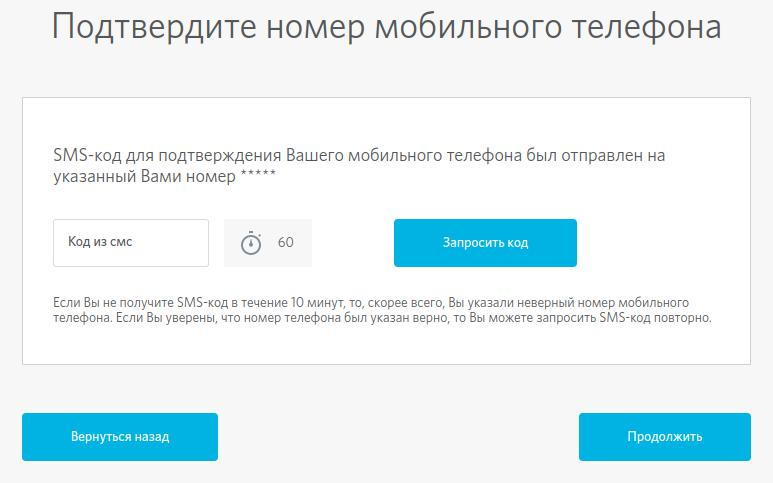
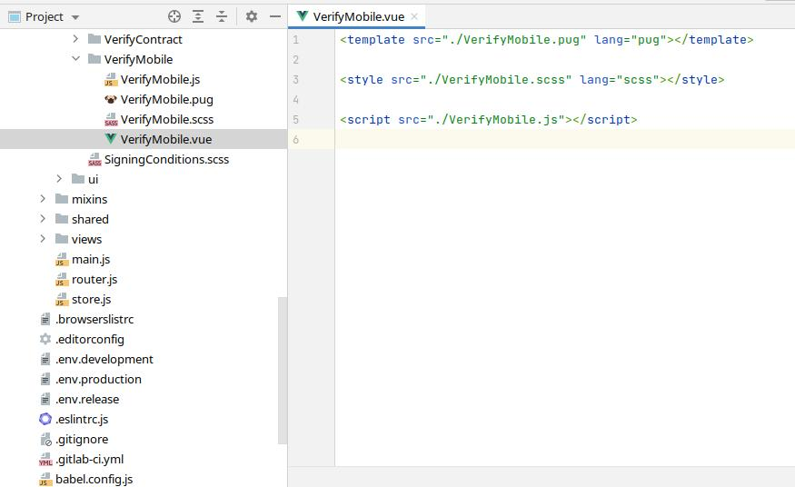
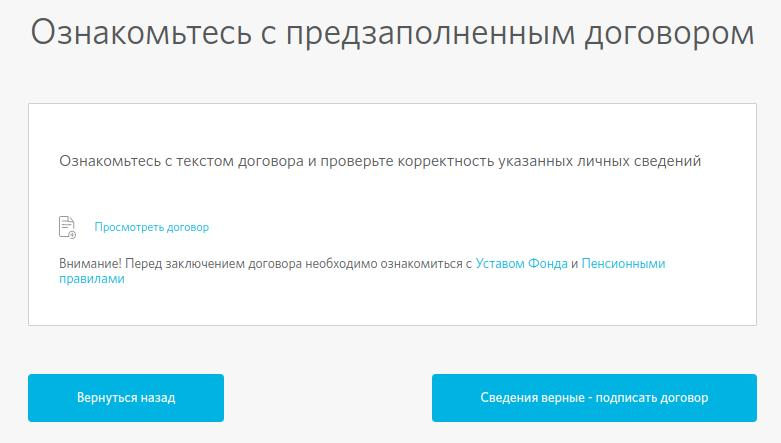
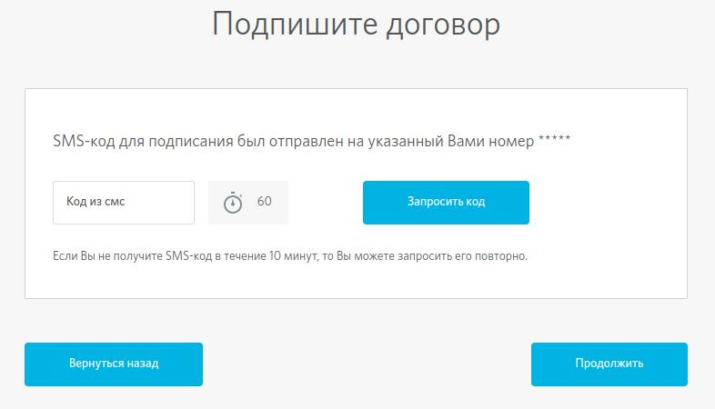
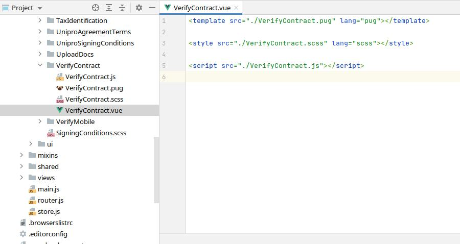
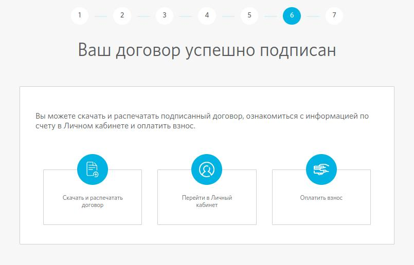

# Сервис ИПО-онлайн

***

## ЭТАП №1: ОЗНАКОМЛЕНИЕ С УСЛОВИЯМИ ДОГОВОРА (заключить договор может только НЕ клиент фонда)

> На 1 этапе пользователь знакомится с условиями договора, условиями его расторжения, подтверждает согласие на обработку персональных данных. Заключить договор может только НЕ клиент фонда.

> Далее пользователь нажимает на одну из двух кнопок:
>  * _Я являюсь клиентом Фонда_
>  * _Я не являюсь клиентом Фонда_

  
> В коде за 1-ый этап у сервиса **ИПО-онлайн** отвечает компонент `IpoSigningConditions`. В данном компоненте находится вся отображаемая верстка и JS логика 1-ого этапа.

***

## ЭТАП №2: ДАННЫЕ ДЛЯ ДОГОВОРА.
> На 2 этапе пользователю предстоит ввести свои данные. Данный этап включает в себя 4 шага которые более детально будут описаны ниже.

> Так как данный этап состоит из нескольких шагов, эти шаги были разбиты на компоненты которые все поочередно вызываются в массиве файла `Scenario.json`.

* ### ШАГ 1 ИЗ 4. ВВОД ЛИЧНЫХ ДАННЫХ.
  > В полях веб-формы необходимо ввести основные данные (ФИО, пол), паспортные данные и СНИЛС. При неправильном заполнении поля СНИЛС (вводе несуществующих данных) поле подсвечивается красным и перейти на следующий шаг нельзя. Также необходимо избегать пробелов после заполнения значений полей ФИО, т.к. в этом случае поля подсветятся красным и перейти на следующий шаг будет невозможно. Далее необходимо дать согласие на обработку персональных данных и ознакомиться с Правилами использования сервиса (сделать это можно только на данном шаге) – два чекбокса внизу страницы. По умолчанию они стоят в положении «Да», без их нажатия переход к следующему шагу невозможен. Правильность ввода паспортных данных и соответствие всех введенных данных указанному ФИО (полная идентификация клиента) будут проверены сервисами СМЭВ и Росфинмониторинг, результат проверки клиент увидит после ответа на вопросы анкеты на Этапе 2, Шаг 3 из 4.
    
    
    
    > В коде за 1-ый Шаг этапа №2 отвечает компонент `BasicUserdata`. В данном компоненте находится вся отображаемая верстка и JS логика 1-ого Шага.
    
    

* ### ШАГ 2 ИЗ 4. ИНФОРМАЦИЯ ОБ ИНН И ЕГО АНАЛОГАХ.
  >По умолчанию активен первый чекбокс «являюсь налоговым резидентом Российской федерации» и окно для ввода ИНН, а также предусмотрена ссылка на сервис ИФНС «Узнайте свой ИНН». Здесь необходимо ввести корректный ИНН, соответствующий ФИО и паспортным данным клиента. Далее для соответствия требованиям законодательства по CRS реализованы поля в раскрывающемся списке «Дополнительно являюсь налоговым резидентом иного государства». Клиент обязан предоставить Фонду информацию о дополнительном резидентстве в случае его наличия. Если оно отсутствует, то клиент сразу переходит на следующий шаг.

  

  > В раскрывающемся списке «Дополнительно являюсь налоговым резидентом иного государства» можно выбрать государство из выпадающего списка, указать дополнительный ИНН в соответствующем поле или причину его непредставления. Можно добавить до 5 государств дополнительного налогового резиденства. После указания всех дополнительных стран и ИНН / причин их отсутствия необходимо перейти на следующий шаг, нажав кнопку «Продолжить».
  > 
  >  При выборе последнего чекбокса «Не являюсь налоговым резидентом ни в одном государстве» продолжить заключение договора невозможно.

  
    
  > В коде за 2-ый Шаг этапа №2 отвечает компонент `TaxIdentification`. В данном компоненте находится вся отображаемая верстка и JS логика 2-ого Шага.

  

* ### ШАГ 3 ИЗ 4. ВВОД ЛИЧНЫХ ДАННЫХ.
  > В полях веб-формы необходимо ввести адрес регистрации (при начале ввода данных адрес подгружается автоматически в выпадающем поле, индекс автоматически заполняется в соответствии с выбранным адресом); адрес места жительства; почтовый адрес (если адрес места жительства и почтовый адрес совпадают с адресом регистрации, необходимо выбрать соответствующий чекбокс и поля заполнятся в соответствии с полем «Адрес регистрации»); номер мобильного телефона (обязательно указывать действующий номер телефона, на него будет направлен SMS-код для подписания договора), номер домашнего телефона (необязательное поле), адрес электронной почты (обязательно указывать действующий e-mail, на него будет отправлен комплект документов после подписания договора).
  > 
  > После ввода данных необходимо дать согласие на обработку персональных данных - чекбокс внизу страницы «Я согласен на обработку моих персональных данных». По умолчанию он стоит в положении «Да», без его нажатия переход к следующему шагу невозможен.

  

  > В коде за 3-ый Шаг этапа №2 отвечает компонент `ContactsUserdata`. В данном компоненте находится вся отображаемая верстка и JS логика 3-го Шага.

  

* ### ШАГ 4 ИЗ 4. ОТВЕТ НА ВОПРОСЫ АНКЕТЫ.
  > Необходимо ответить на 6 вопросов анкеты. По умолчанию отмечены все ответы «Нет». В случае если на один или несколько из первых 4 вопросов получен ответ «Да», переход на следующий шаг невозможен.
  > 
  > Ответы на 5 и 6 вопросы могут быть любыми. В случае выбора «Да» из выпадающего списка надо выбрать одно из государств.
  > 
  > После ответов на первые 4 вопроса «Нет» и любого ответа на 5 и 6 вопросы следует нажать на кнопку «Продолжить».

  

  > В коде за 4-ый Шаг этапа №2 отвечает компонент `ForeignUserdata`. В данном компоненте находится вся отображаемая верстка и JS логика 4-ого Шага.

  

* ### ВЫПОЛНЕНИЕ ПРОВЕРОК СМЭВ И РОСФИНМОНИТОРИНГ
  > После прикрепления копий документов клиент может увидеть поп-ап «Выполняется операция». Этот поп-ап появляется, если на этапе заполнения данных клиента была допущена ошибка в полях ФИО, серия и номер паспорта, СНИЛС или ИНН либо при длительной обработке запроса СМЭВ. Данная проверка может длиться до 15 минут. Если на Этапе 2 СНИЛС и ИНН прошли проверку на корректность (сервис определил, что введены существующие СНИЛС и ИНН), ошибка в этих параметрах может означать, что были введены данные другого человека и ФИО не идентифицируется с паспортными данными, СНИЛС или ИНН либо клиент не прошел проверку на терроризм.
  > 
  > Если проверки выявили несопоставление данных клиента по указанным выше параметрам, либо клиент не прошел проверку на терроризм (об этом сервис не сообщает клиенту напрямую), через некоторое время появится поп-ап «Внимание!» с информацией о возможных допущенных ошибках и кнопкой «Изменить данные», которая возвращает на Этап 2, Шаг 1 из 4 для изменения данных. Если клиент уверен, что все данные указаны верно, это означает, что он не прошел именно проверку на терроризм. В данном случае заключение договора с помощью сервиса невозможно.
  > 
  > При возникновении поп-апа с информацией о превышении количества обращений к сервису следует повторить попытку заключения договора позднее, т.к. запрос на проверку данных не получил ответа от СМЭВ (ни положительного, ни отрицательного). Данный поп-ап появляется по истечении 15 минут после отправки запросов через СМЭВ.

***

## ЭТАП №3: ПОДТВЕРЖДЕНИЕ НОМЕРА МОБИЛЬНОГО ТЕЛЕФОНА.
> Для подтверждения номера мобильного телефона в окно «Код из SMS» следует ввести четырехзначный код, полученный в SMS на номер мобильного телефона, указанный на Этапе 2, Шаг 3 из 4 «Ввод личных данных». После ввода SMS-кода необходимо нажать кнопку «Сведения верные – подписать договор».
> 
> Полностью увидеть указанный ранее номер телефона  на данном этапе невозможно. Если SMS-код не пришел сразу, через минуту после перехода на данный этап становится активной кнопка «Запросить код», с помощью которой можно запросить SMS-код повторно.
> 
> Если SMS-код  не пришел в течение 10 минут, то, скорее всего, номер мобильного телефона был указан неверно. В этом случае необходимо вернуться на Этап 2, Шаг 3 из 4 и исправить/указать новый номер мобильного телефона.
> 
> Если номер мобильного телефона указан верно, SMS может не приходить только по причине проблемы с оператором сотовой связи клиента либо недоступности SMS-шлюза Фонда.
>
> Для введения SMS-кода есть 3 попытки. Если код введен неверно 3 раза подряд, доступ к сервису блокируется на сутки.

 

> В коде за 3-ий этап у сервиса **ИПО-онлайн** отвечает компонент `VerifyMobile`. В данном компоненте находится вся отображаемая верстка и JS логика 3-го этапа.

***

## ЭТАП №4: ОЗНАКОМЛЕНИЕ С ПРЕДЗАПОЛНЕННЫМ ДОГОВОРОМ.
> На данном этапе можно ознакомиться с предзаполненным договором со всеми внесенными данными клиента (кроме номера договора, даты подписания и подписей клиента и Фонда). Для этого необходимо нажать на ссылку «Посмотреть договор», договор откроется в новой вкладке. Если в предзаполненном договоре все данные указаны верно, то необходимо перейти на следующий шаг, нажав кнопку «Подписать». Если какие-то данные указаны некорректно, необходимо вернуться на Этап 2 кнопкой «Вернуться назад» и исправить неверную информацию, после чего вернуться к подписанию договора на Этапе 4.

> В коде за 4-ий этап у сервиса **ИПО-онлайн** отвечает компонент `PrefilledContract`. В данном компоненте находится вся отображаемая верстка и JS логика 4-ого этапа.

***

## ЭТАП №5: ПОДПИСАНИЕ ДОГОВОРА.
> В случае, если клиент дошел до шага подписания договора, но при этом уже является клиентом Фонда по другому договору, он попадет на страницу с информацией, что он является клиентом Фонда и может узнать подробнее о способах заключения договора на сайте либо перейти в Личный кабинет для заключения договора там. Дальнейшее заключение договора на сайте невозможно.
> 
> Для подписания договора простой электронной подписью в окно «Код из SMS» следует ввести четырехзначный код, полученный в SMS на подтвержденный на Этапе 4 номер мобильного телефона. После ввода SMS-кода необходимо нажать кнопку «Подписать».
> 
> Полностью увидеть указанный ранее номер телефона  на данном этапе невозможно. Если SMS-код не пришел сразу, через минуту после перехода на данный этап становится активной кнопка «Запросить код», с помощью которой можно запросить SMS-код повторно.
> 
> Поскольку номер мобильного телефона ранее был подтвержден, SMS может не приходить только по причине проблемы с оператором сотовой связи клиента либо недоступности SMS-шлюза Фонда.
> 
> Для введения SMS-кода есть 3 попытки. Если код введен неверно 3 раза подряд, доступ к сервису блокируется на сутки.

> В коде за 5-ий этап у сервиса **ИПО-онлайн** отвечает компонент `VerifyContract`. В данном компоненте находится вся отображаемая верстка и JS логика 5-ого этапа.

***

## ЭТАП №6: УСПЕШНОЕ ПОДПИСАНИЕ ДОГОВОРА.
> Если все проверки были пройдены успешно, введен корректный код из SMS и пользователь не является действующим клиентом Фонда, его договор формируется, подписывается простой электронной подписью и передается в УС Хронос. Клиент переходит на Этап 6 «Ваш договор успешно подписан», на котором появляются три варианта дальнейших действий:
> * Скачать и распечатать договор;
> * Перейти в Личный кабинет;
> * Оплатить взнос (оплата взноса реализована как отдельный этап, после выбора действия «Оплатить взнос» клиента перенаправит на страницу выбора вариантов оплаты).

> В коде за 6-ий этап у сервиса **ИПО-онлайн** отвечает компонент `PayFee`. В данном компоненте находится вся отображаемая верстка и JS логика 6-ого этапа.

***

## ЭТАП №7: ОПЛАТА ВЗНОСА.
> На 7-м этапе можно выбрать один из трех вариантов оплаты:
> * Онлайн-оплата банковской картой (Visa, MasterCard или МИР);
> * Оплата по квитанции в любом отделении банка (распечатав квитанцию) или через интернет-банк (по реквизитам из квитанции);
> * Оплата по заявлению через работодателя

> В коде за 7-ий этап у сервиса **ИПО-онлайн** отвечает компонент `PaymentOptions`. В данном компоненте находится вся отображаемая верстка и JS логика 7-ого этапа.

* ### ПРИ ВЫБОРЕ ОНЛАЙН-ОПЛАТА БАНКОВСКОЙ КАРТОЙ
  > Клиенту необходимо заполнить поле «Сумма оплаты» и проставить согласие в чекбоксе «Я подтверждаю, что карта, с которой производится оплата, принадлежит мне». Нажатие кнопки «Оплатить» переводит на страницу банка-эквайера, осуществляющего платеж. Без проставленного согласия клиента в чекбоксе «Я подтверждаю, что карта, с которой производится оплата, принадлежит мне» переход на страницу оплаты невозможен.

  

  > После онлайн-оплаты картой клиент попадет на одну из двух страниц: «Оплата прошла успешно» либо «Во время платежа произошла ошибка».
  >
  > Если оплата прошла успешно, клиент увидит информацию о сроках зачисления средств и кнопку регистрации в Личном кабинете для отслеживания информации по договору.
  > 
  > Если по техническим причинам оплата не была произведена (недостаточно средств на карте клиента, проблемы на стороне банка-эквайера, проблемы на стороне сервиса), клиент может вернуться к шагу с выбором варианта оплаты, закрыв текущее окно, либо зарегистрироваться в Личном кабинете для оплаты взноса.
  
* ### ПРИ ВЫБОРЕ ОПЛАТА ПО КВИТАНЦИИ
  > При выборе оплаты по квитанции клиента перенаправляет на предзаполненную веб-форму квитанции, все данные в квитанцию загружаются сервисом автоматически, указать нужно только сумму платежа. Чекбокс о согласии на обработку персональных данных по умолчанию стоит в положении «Да». Клиенту нужно нажать кнопку «Распечатать», после чего откроется следующее окно. Если клиент желает выбрать другой способ оплаты, ему необходимо нажать кнопку «Вернуться назад».
  
  

* ### ПРИ ВЫБОРЕ ОПЛАТА ПО ЗАЯВЛЕНИЮ ДЛЯ РАБОТОДАТЕЛЯ
  > При выборе оплаты по заявлению для работодателя клиента перенаправляет на предзаполненную веб-форму заявления, все данные в заявление загружаются сервисом автоматически, указать нужно только наименование организации работодателя, дату начала перечисления взносов, периодичность и сумму платежа (в рублях или % от зарплаты). Чекбокс о согласии на обработку персональных данных по умолчанию стоит в положении «Да». Клиенту нужно нажать кнопку «Распечатать», после чего откроется следующее окно. Если клиент желает выбрать другой способ оплаты, ему необходимо нажать кнопку «Вернуться назад».

  
