# Сервис НПО-онлайн (Лукойл)

***

## ЭТАП №1: ОЗНАКОМЛЕНИЕ С УСЛОВИЯМИ ДОГОВОРА

> Первый этап заключения договора позволяет ознакомиться с: условиями подписания договора, вступлением договора в силу, порядком внесения пенсионных взносов, условиями выплаты пенсий, внесением взносов, расторжением договора и возвратом средств, налоговым вычетом, а также с Уставом Фонда и Пенсионными правилами.
>
> Для перехода к процедуре заключения договора необходимо нажать кнопку «Участвовать в программе»

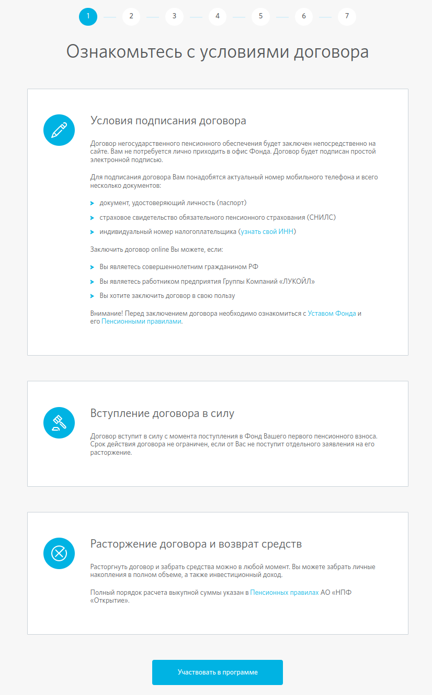
  
> В коде за 1-ый этап у сервиса **НПО-онлайн** отвечает компонент `IpoSigningConditions`. В данном компоненте находится вся отображаемая верстка и JS логика 1-ого этапа.

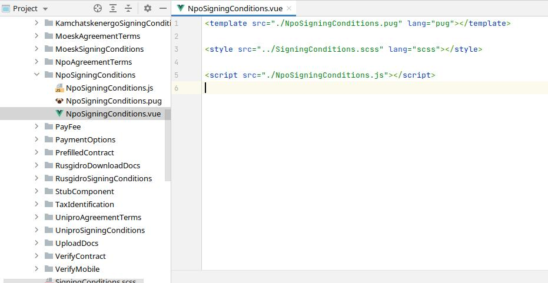

***

## ЭТАП №2:  ДАННЫЕ ДЛЯ ДОГОВОРА.
> На 2 этапе пользователю предстоит ввести свои данные. Данный этап включает в себя 5 шагов которые более детально будут описаны ниже.

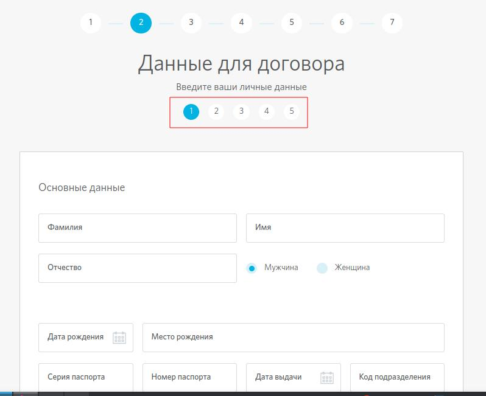

> Так как данный этап состоит из нескольких шагов, эти шаги были разбиты на компоненты которые все поочередно вызываются в массиве файла `Scenario.json`.

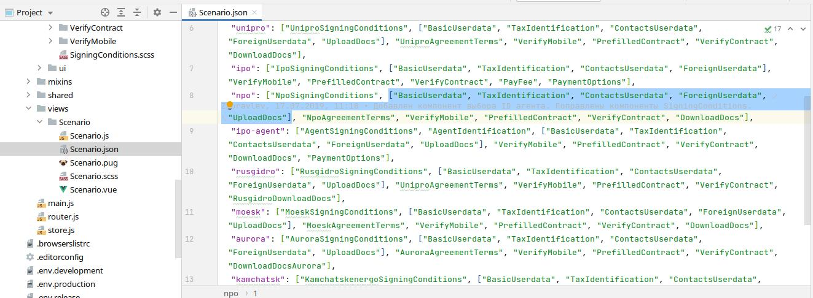

* ### ШАГ 1 ИЗ 5. ВВОД ЛИЧНЫХ ДАННЫХ.
  > В полях веб-формы необходимо ввести основные данные (ФИО, пол), паспортные данные и СНИЛС. При неправильном заполнении поля СНИЛС (вводе несуществующих данных) поле подсвечивается красным и перейти на следующий шаг нельзя. Также необходимо избегать пробелов после заполнения значений полей ФИО, т.к. в этом случае поля подсветятся красным и перейти на следующий шаг будет невозможно. Далее необходимо дать согласие на обработку персональных данных и ознакомиться с Правилами использования сервиса (сделать это можно только на данном шаге) – два чекбокса внизу страницы. По умолчанию они стоят в положении «Да», без их нажатия переход к следующему шагу невозможен. Правильность ввода паспортных данных и соответствие всех введенных данных указанному ФИО (полная идентификация клиента) будут проверены сервисами СМЭВ и Росфинмониторинг, результат проверки клиент увидит после ответа на вопросы анкеты на Этапе 2, Шаг 3 из 5.
    
    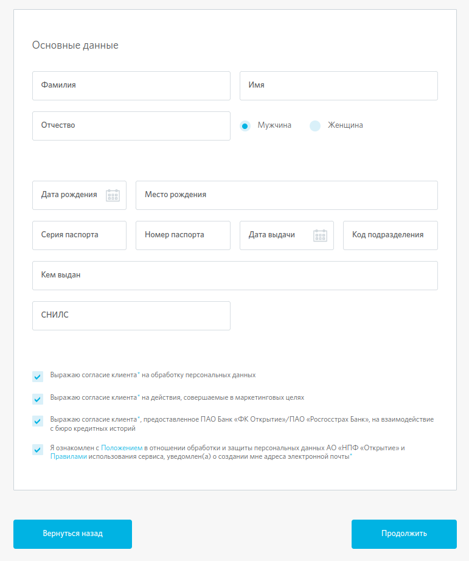
    
    > В коде за 1-ый Шаг этапа №2 отвечает компонент `BasicUserdata`. В данном компоненте находится вся отображаемая верстка и JS логика 1-ого Шага.
    
    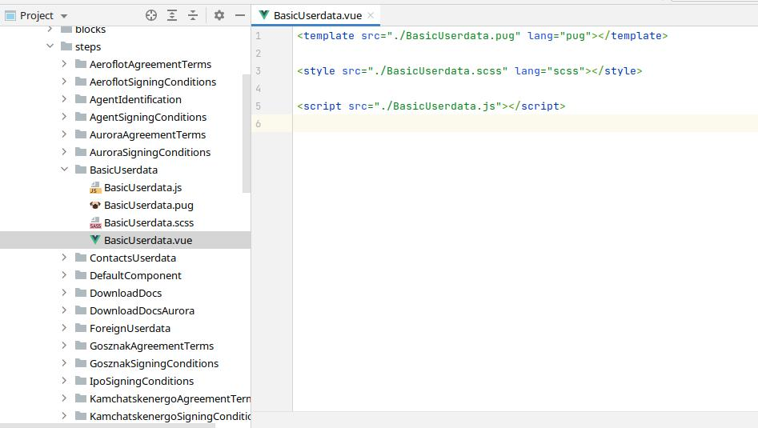

* ### ШАГ 2 ИЗ 5. ИНФОРМАЦИЯ ОБ ИНН И ЕГО АНАЛОГАХ.
  > По умолчанию активен первый чекбокс «являюсь налоговым резидентом Российской федерации» и окно для ввода ИНН, а также предусмотрена ссылка на сервис ИФНС «Узнайте свой ИНН». Здесь необходимо ввести корректный ИНН, соответствующий ФИО и паспортным данным клиента. Далее для соответствия требованиям законодательства по CRS реализованы поля в раскрывающемся списке «Дополнительно являюсь налоговым резидентом иного государства». Клиент обязан предоставить Фонду информацию о дополнительном резидентстве в случае его наличия. Если оно отсутствует, то клиент сразу переходит на следующий шаг.

  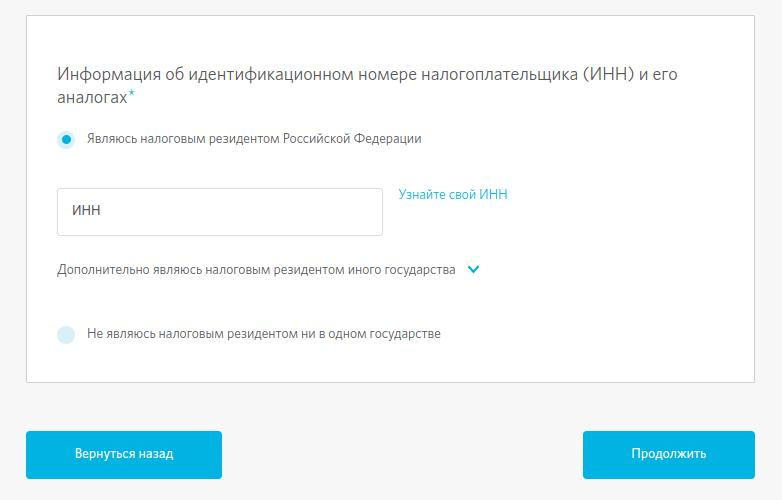

  > В раскрывающемся списке «Дополнительно являюсь налоговым резидентом иного государства» можно выбрать государство из выпадающего списка, указать дополнительный ИНН в соответствующем поле или причину его непредставления. Можно добавить до 5 государств дополнительного налогового резиденства. После указания всех дополнительных стран и ИНН / причин их отсутствия необходимо перейти на следующий шаг, нажав кнопку «Продолжить».
  > 
  >  При выборе последнего чекбокса «Не являюсь налоговым резидентом ни в одном государстве» продолжить заключение договора невозможно.

  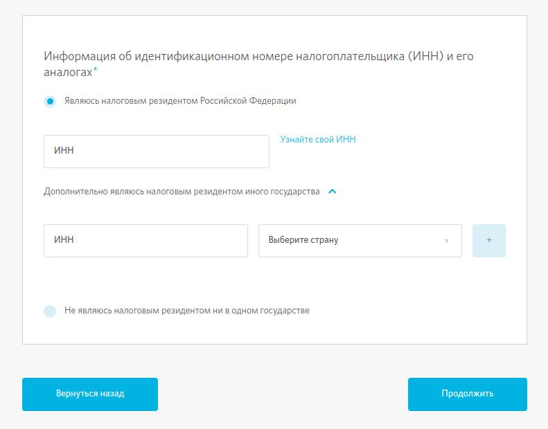
    
  > В коде за 2-ый Шаг этапа №2 отвечает компонент `TaxIdentification`. В данном компоненте находится вся отображаемая верстка и JS логика 2-ого Шага.

  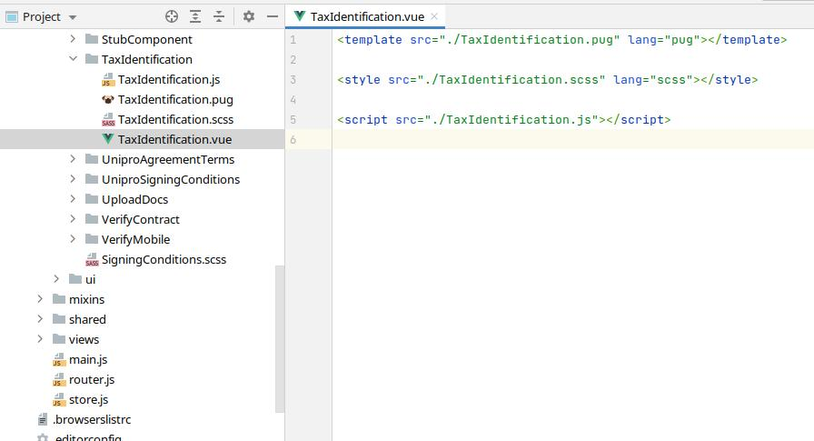

* ### ШАГ 3 ИЗ 5. ВВОД ЛИЧНЫХ ДАННЫХ.
  > В полях веб-формы необходимо ввести адрес регистрации (при начале ввода данных адрес подгружается автоматически в выпадающем поле, индекс автоматически заполняется в соответствии с выбранным адресом); адрес места жительства; почтовый адрес (если адрес места жительства и почтовый адрес совпадают с адресом регистрации, необходимо выбрать соответствующий чекбокс и поля заполнятся в соответствии с полем «Адрес регистрации»); номер мобильного телефона (обязательно указывать действующий номер телефона, на него будет направлен SMS-код для подписания договора), номер домашнего телефона (необязательное поле), адрес электронной почты (обязательно указывать действующий e-mail, на него будет отправлен комплект документов после подписания договора).
  > 
  > После ввода данных необходимо дать согласие на обработку персональных данных - чекбокс внизу страницы «Я согласен на обработку моих персональных данных». По умолчанию он стоит в положении «Да», без его нажатия переход к следующему шагу невозможен.

  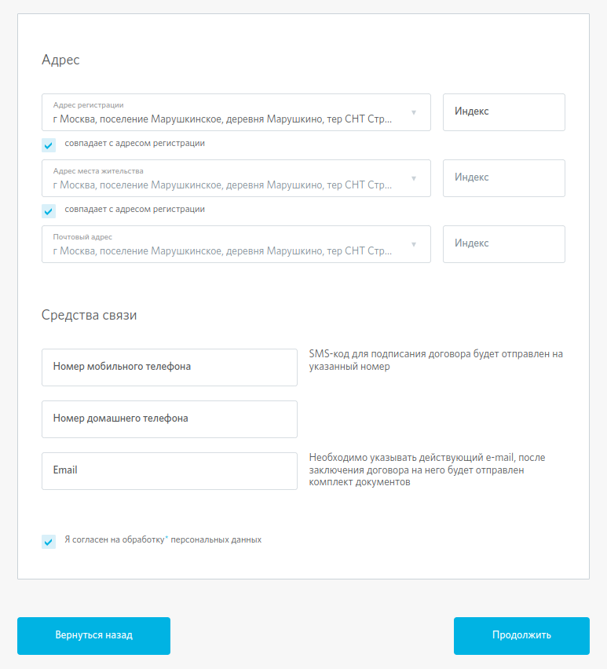

  > В коде за 3-ый Шаг этапа №2 отвечает компонент `ContactsUserdata`. В данном компоненте находится вся отображаемая верстка и JS логика 3-го Шага.

  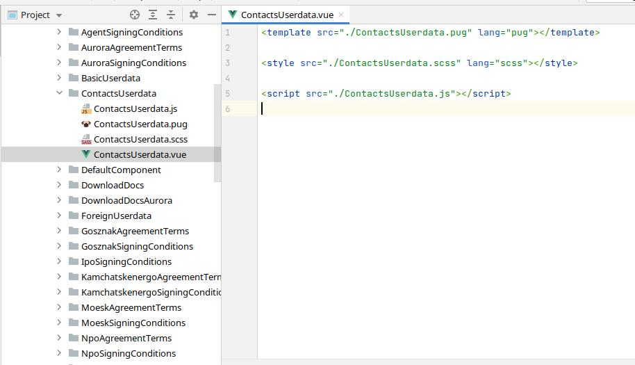

* ### ШАГ 4 ИЗ 5. ОТВЕТ НА ВОПРОСЫ АНКЕТЫ.
  > Необходимо ответить на 6 вопросов анкеты. По умолчанию отмечены все ответы «Нет». В случае если на один или несколько из первых 4 вопросов получен ответ «Да», переход на следующий шаг невозможен.
  > 
  > Ответы на 5 и 6 вопросы могут быть любыми. В случае выбора «Да» из выпадающего списка надо выбрать одно из государств.
  > 
  > После ответов на первые 4 вопроса «Нет» и любого ответа на 5 и 6 вопросы следует нажать на кнопку «Продолжить».

  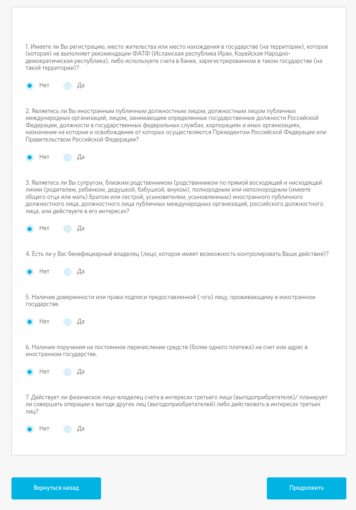

  > В коде за 4-ый Шаг этапа №2 отвечает компонент `ForeignUserdata`. В данном компоненте находится вся отображаемая верстка и JS логика 4-ого Шага.

  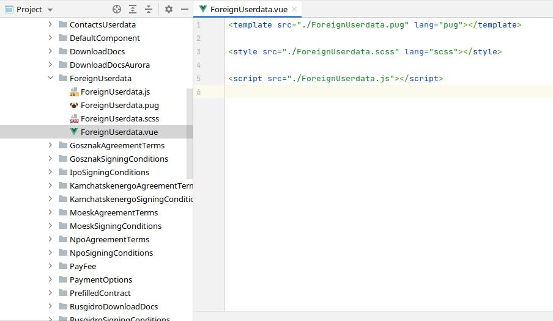

* ### ШАГ 5 ИЗ 5. ПРИКРЕПЛЕНИЕ КОПИЙ ДОКУМЕНТОВ.
  > На данном шаге необходимо прикрепить копии документов, подтверждающих личность пользователя: страницы паспорта с фотографией, страницы паспорта с пропиской, СНИЛС. Загружать документы необходимо в соответствующие поля, в которых написаны подсказки, какую именно копию в какое поле прикреплять. Сделать это можно двумя способами: перетянув файлы с изображениями в каждое из трёх окон либо нажав на кнопку «Выберите файл». Копии документов прикрепляются в форматах png, jpeg или pdf, прикрепить можно отсканированный или сфотографированный файл.
  > 
  > После прикрепления изображений нужно нажать на кнопку «Продолжить». В случае если прикреплены не все копии документов, появится уведомление о необходимости прикрепить полный комплект документов. Без полного комплекта документов переход на следующий шаг невозможен.

  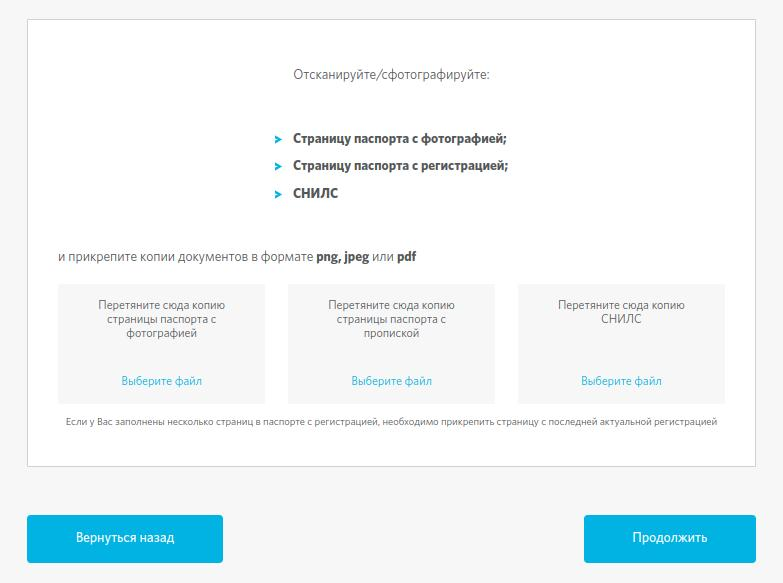

  > В коде за 5-ый Шаг этапа №2 отвечает компонент `UploadDocs`. В данном компоненте находится вся отображаемая верстка и JS логика 5-ого Шага.

  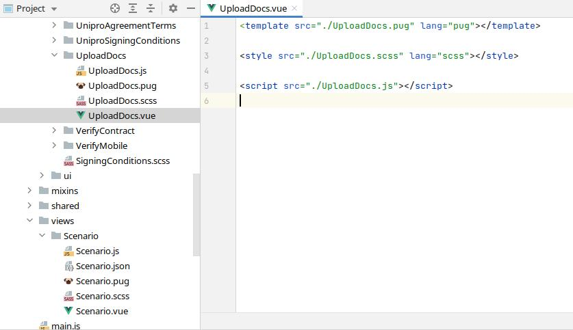

* ### ВЫПОЛНЕНИЕ ПРОВЕРОК СМЭВ И РОСФИНМОНИТОРИНГ
  > После прикрепления копий документов клиент может увидеть поп-ап «Выполняется операция». Этот поп-ап появляется, если на этапе заполнения данных клиента была допущена ошибка в полях ФИО, серия и номер паспорта, СНИЛС или ИНН либо при длительной обработке запроса СМЭВ. Данная проверка может длиться до 15 минут. Если на Этапе 2 СНИЛС и ИНН прошли проверку на корректность (сервис определил, что введены существующие СНИЛС и ИНН), ошибка в этих параметрах может означать, что были введены данные другого человека и ФИО не идентифицируется с паспортными данными, СНИЛС или ИНН либо клиент не прошел проверку на терроризм.
  > 
  > Если проверки выявили несопоставление данных клиента по указанным выше параметрам, либо клиент не прошел проверку на терроризм (об этом сервис не сообщает клиенту напрямую), через некоторое время появится поп-ап «Внимание!» с информацией о возможных допущенных ошибках и кнопкой «Изменить данные», которая возвращает на Этап 2, Шаг 1 из 5 для изменения данных. Если клиент уверен, что все данные указаны верно, это означает, что он не прошел именно проверку на терроризм. В данном случае заключение договора с помощью сервиса невозможно.
  > 
  > При возникновении поп-апа с информацией о превышении количества обращений к сервису следует повторить попытку заключения договора позднее, т.к. запрос на проверку данных не получил ответа от СМЭВ (ни положительного, ни отрицательного). Данный поп-ап появляется по истечении 15 минут после отправки запросов через СМЭВ.
  > 
  > Также на этапе проверки выясняется, не является ли пользователь действующим клиентом Фонда по НПО. Если проверка сопоставит данные пользователя с данными действующего клиента Фонда по НПО, то он увидит поп-ап с информацией о наличии у него действующего договора, узнать о котором можно, перейдя в Личный кабинет по нажатию на виджет «Перейти в Личный кабинет».
  > 
  > В этом случае дальнейшее заключение договора невозможно.

***

## ЭТАП №3: ВЫБОР УСЛОВИЙ ДОГОВОРА.
> После успешного прохождения проверок и в случае отсутствия у пользователя действующего договора с Фондом по НПО ему необходимо выбрать условия договора.
> 
> В поле «Предприятие и представитель» надо начать вводить название своего предприятия и из выпадающего списка выбрать правильное название предприятия и соответствующего агента на предприятии.
> 
> В поле «% отчисления» нужно выбрать желаемый % отчисления от 1% до 4% с шагом в 0,5%.

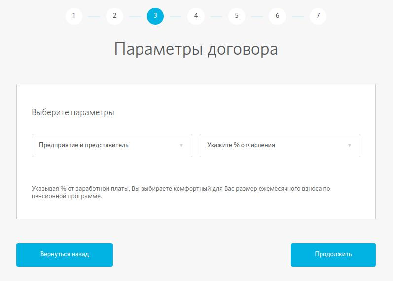 

> В коде за 3-ий этап у сервиса **НПО-онлайн** отвечает компонент `NpoAgreementTerms`. В данном компоненте находится вся отображаемая верстка и JS логика 3-го этапа.

***

## ЭТАП №4: ПОДТВЕРЖДЕНИЕ НОМЕРА МОБИЛЬНОГО ТЕЛЕФОНА.
> Для подтверждения номера мобильного телефона в окно «Код из SMS» следует ввести четырехзначный код, полученный в SMS на номер мобильного телефона, указанный на Этапе 2, Шаг 3 из 5 «Ввод личных данных». После ввода SMS-кода необходимо нажать кнопку «Сведения верные – подписать договор». Полностью увидеть указанный ранее номер телефона  на данном этапе невозможно. Если SMS-код не пришел сразу, через минуту после перехода на данный этап становится активной кнопка «Запросить код», с помощью которой можно запросить SMS-код повторно.
> 
> Если SMS-код  не пришел в течение 10 минут, то, скорее всего, номер мобильного телефона был указан неверно. В этом случае необходимо вернуться на Этап 2, Шаг 3 из 5 и исправить/указать новый номер мобильного телефона.
> 
> Если номер мобильного телефона указан верно, SMS может не приходить только по причине проблемы с оператором сотовой связи клиента либо недоступности SMS-шлюза Фонда.
> 
> Для введения SMS-кода есть 3 попытки. Если код введен неверно 3 раза подряд, доступ к сервису блокируется на сутки.

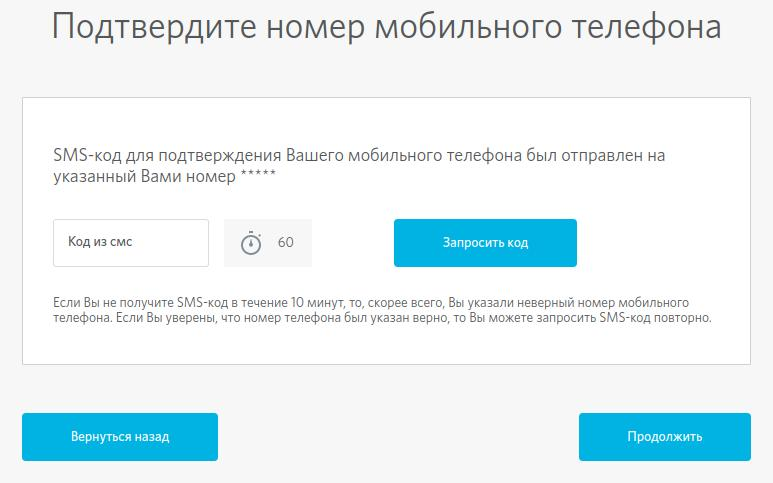

> В коде за 4-ий этап у сервиса **НПО-онлайн** отвечает компонент `VerifyMobile`. В данном компоненте находится вся отображаемая верстка и JS логика 4-ого этапа.

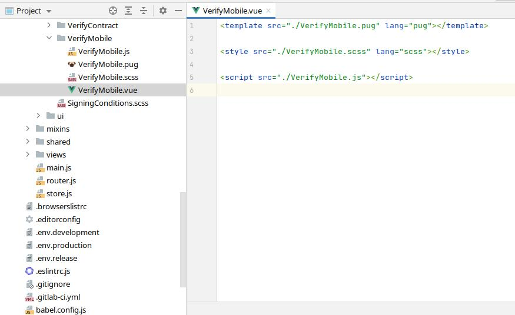

***

## ЭТАП №5: ОЗНАКОМЛЕНИЕ С ПРЕДЗАПОЛНЕННЫМ ДОГОВОРОМ.
> На данном этапе можно ознакомиться с предзаполненным договором со всеми внесенными данными клиента (кроме номера договора, даты подписания и подписей клиента и Фонда). Для этого необходимо нажать на ссылку «Посмотреть договор», договор откроется в новом окне. Если в предзаполненном договоре все данные указаны верно, то необходимо перейти на следующий шаг, нажав кнопку «Подписать». Если какие-то данные указаны некорректно, необходимо вернуться на Этап 2 кнопкой «Вернуться назад» и исправить неверную информацию, после чего вернуться к подписанию договора на Этапе 5.

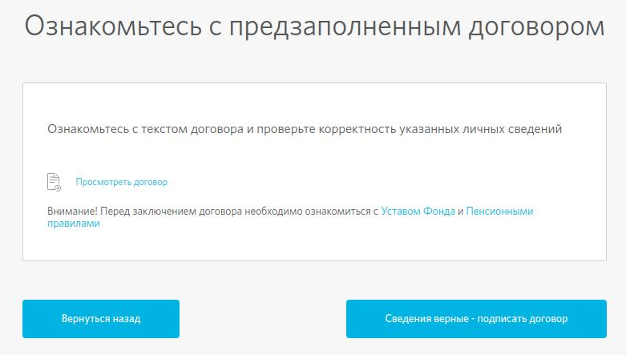

> В коде за 5-ий этап у сервиса **НПО-онлайн** отвечает компонент `PrefilledContract`. В данном компоненте находится вся отображаемая верстка и JS логика 5-ого этапа.

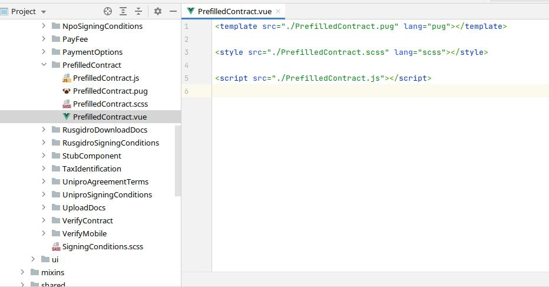

***

## ЭТАП №6: ПОДПИСАНИЕ ДОГОВОРА.
> Для подписания договора простой электронной подписью в окно «Код из SMS» следует ввести четырехзначный код, полученный в SMS на подтвержденный на Этапе 4 номер мобильного телефона. После ввода SMS-кода необходимо нажать кнопку «Подписать».
> 
> Полностью увидеть указанный ранее номер телефона  на данном этапе невозможно. Если SMS-код не пришел сразу, через минуту после перехода на данный этап становится активной кнопка «Запросить код», с помощью которой можно запросить SMS-код повторно.
> 
> Поскольку номер мобильного телефона ранее был подтвержден, SMS может не приходить только по причине проблемы с оператором сотовой связи клиента либо недоступности SMS-шлюза Фонда.
> 
> Для введения SMS-кода есть 3 попытки. Если код введен неверно 3 раза подряд, доступ к сервису блокируется на сутки.

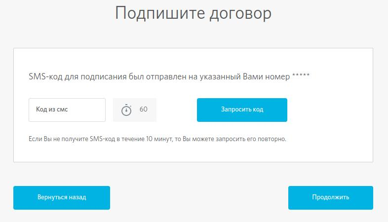

> В коде за 6-ий этап у сервиса **НПО-онлайн** отвечает компонент `VerifyContract`. В данном компоненте находится вся отображаемая верстка и JS логика 6-ого этапа.

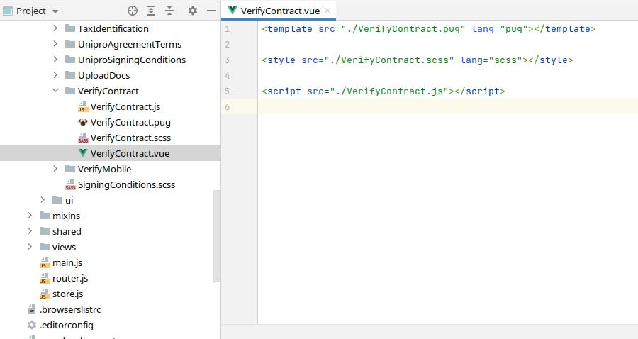

***

## ЭТАП №7: УСПЕШНОЕ ПОДПИСАНИЕ ДОГОВОРА И КОМПЛЕКТ ДОКУМЕНТОВ.
> Если все проверки были пройдены успешно и введен корректный код из SMS, договор пользователя формируется, подписывается простой электронной подписью и передается в УС Хронос. Пользователь переходит на Этап 7 «Ваш договор успешно подписан», на котором появляются два варианта дальнейших действий:
> * Отправить комплект документов на почту
> * Скачать и распечатать комплект документов

> Комплект документов включает в себя подписанный простой электронной подписью Договор со всеми заполненными данными клиента, в котором проставлены дата подписания и номер договора;  предзаполненное Заявление на уплату взносов по договору НПО (через работодателя); предзаполненное Заявление о предоставлении социального налогового вычета и Памятку клиента.

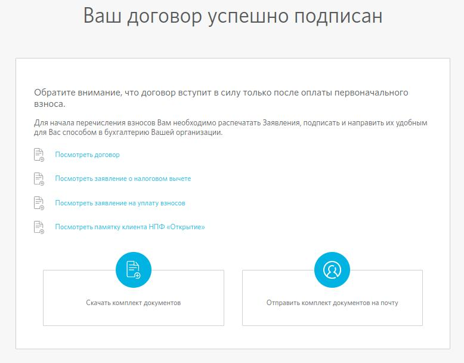

> В коде за 7-ий этап у сервиса **НПО-онлайн** отвечает компонент `DownloadDocs`. В данном компоненте находится вся отображаемая верстка и JS логика 7-ого этапа.

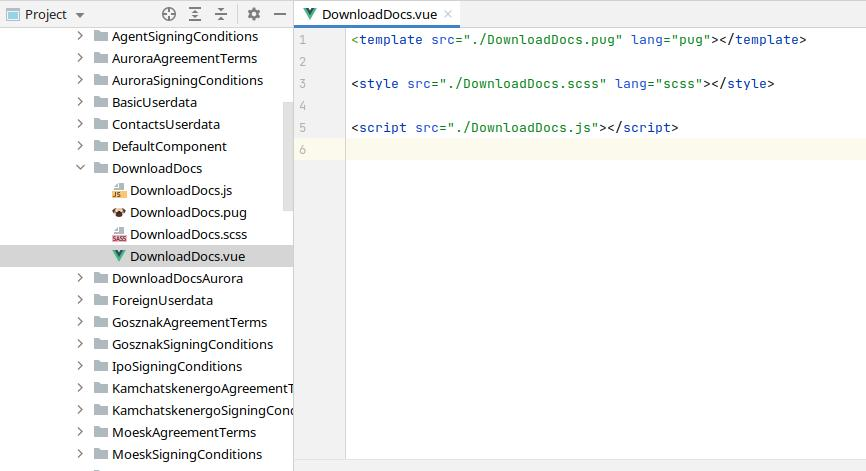

* ### СКАЧАТЬ И РАСПЕЧАТАТЬ КОМПЛЕКТ ДОКУМЕНТОВ
  > Комплект документов будет скачан в виде ZIP –архива на устройство клиента. Комплект документов из письма клиент может открыть на своем устройстве, распечатать или сохранить.
  
* ### ОТПРАВИТЬ КОМПЛЕКТ ДОКУМЕНТОВ НА ПОЧТУ
  > После выбора отправки документов на почту клиенту будет необходимо подтвердить согласие на отправку документов по электронной почте себе и агенту на предприятии, указанному на Этапе 2, которое появится в виде поп-апа.
  > 
  > Комплект документов будет отправлен на e-mail клиента, указанный на Этапе 2, и на e-mail агента на предприятии, выбранного на Этапе 3, как ZIP–архив во вложении к письму от Фонда.
  
***

## ВОЗМОЖНЫЕ ПРОБЛЕМЫ ПРИ ЗАКЛЮЧЕНИИ ДОГОВОРА
> В случае если на каком-то из этапов один из используемых при заключении договора сервисов недоступен / отрабатывает некорректно или в процессе заключения договора произойдет какая-либо ошибка, клиент увидит поп-ап «Внимание!» с информацией о произошедшей технической ошибке и рекомендацией попробовать заключить договор позднее.
